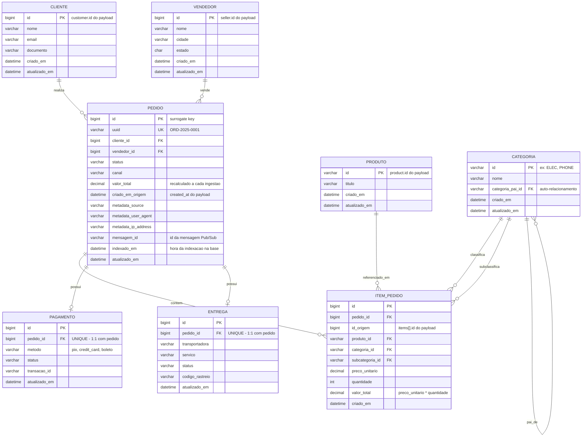

# DER — Banco de Dados `marketplace`

Modelo relacional que recebe os pedidos publicados no tópico `aula-pub` do Google Cloud Pub/Sub.

## Diagrama

## Cardinalidades

| Relacionamento | Cardinalidade | Observação |
|---|---|---|
| cliente → pedido | 1:N | um cliente tem vários pedidos |
| vendedor → pedido | 1:N | `vendedor_id` é opcional (payload pode não trazer `seller`) |
| pedido → item_pedido | 1:N | `ON DELETE CASCADE` |
| produto → item_pedido | 1:N | o mesmo produto aparece em vários pedidos |
| categoria → item_pedido | 1:N (duas vezes) | `categoria_id` e `subcategoria_id` apontam para a mesma tabela |
| categoria → categoria | 1:N | auto-relacionamento: `PHONE` tem `ELEC` como pai |
| pedido → pagamento | 1:1 | garantido por `UNIQUE (pedido_id)` |
| pedido → entrega | 1:1 | garantido por `UNIQUE (pedido_id)` |

## Decisões de modelagem

**Tabelas exigidas pelo enunciado.** `pedido`, `cliente`, `produto` e `item_pedido` existem com esses
nomes exatos. As demais (`vendedor`, `categoria`, `pagamento`, `entrega`) foram acrescentadas para
normalizar o restante do payload.

**Chave natural x chave substituta.** `cliente`, `vendedor`, `produto` e `categoria` usam o id que vem
no payload como chave primária, porque são identificadores estáveis do sistema de origem. `pedido` usa
um `id` auto-incremento com o `uuid` em índice `UNIQUE` — o `uuid` é a chave de negócio usada pela API
e a que garante a idempotência do consumidor.

**`indexado_em`.** Atende ao requisito "registre a hora que a mensagem foi indexada na base de dados".
É gravado a cada ingestão, junto com o `mensagem_id` da mensagem do Pub/Sub que originou a gravação.

**Categoria com auto-relacionamento.** O payload traz `category.sub_category` aninhada. Em vez de duas
tabelas quase idênticas, uma única tabela `categoria` referencia a si mesma por `categoria_pai_id`.
O item guarda as duas pontas (`categoria_id` e `subcategoria_id`) para permitir consulta direta por
qualquer um dos níveis.

**`valor_total` redundante.** O enunciado pede para gravar o total e recalculá-lo quando houver
alteração. Ele é persistido em `pedido.valor_total` e `item_pedido.valor_total`, recalculado a cada
mensagem recebida. A API, porém, **sempre soma dinamicamente** `preco_unitario * quantidade` na
consulta, de modo que o valor exibido não depende da coluna estar em dia.

**`status` como VARCHAR, não ENUM.** O enunciado lista `created, paid, shipped, delivered, canceled`,
mas o payload de exemplo usa `separated`. Um `ENUM` rejeitaria a mensagem do professor; o `VARCHAR`
aceita qualquer status e o `financial-summary` agrupa dinamicamente o que existir na base.

**`metadata` desnormalizado.** `source`, `user_agent` e `ip_address` são telemetria 1:1 com o pedido e
nunca são consultados isoladamente, então ficaram como colunas de `pedido`. Já `pagamento` e `entrega`
viraram tabelas próprias porque têm ciclo de vida e status independentes do pedido.
